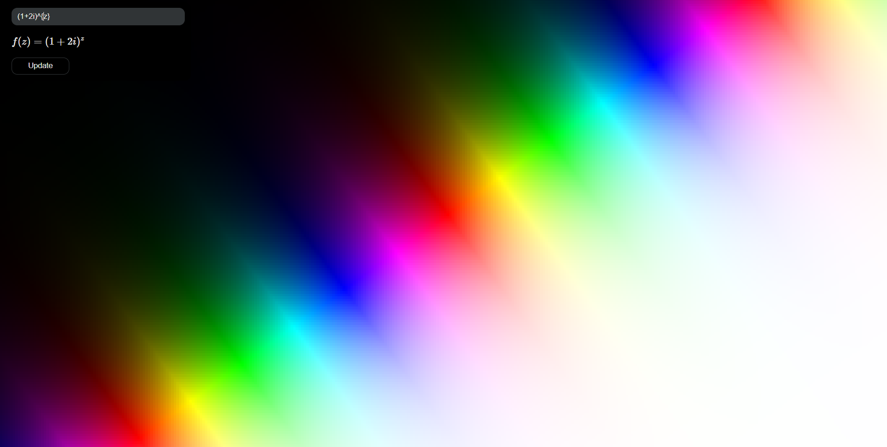
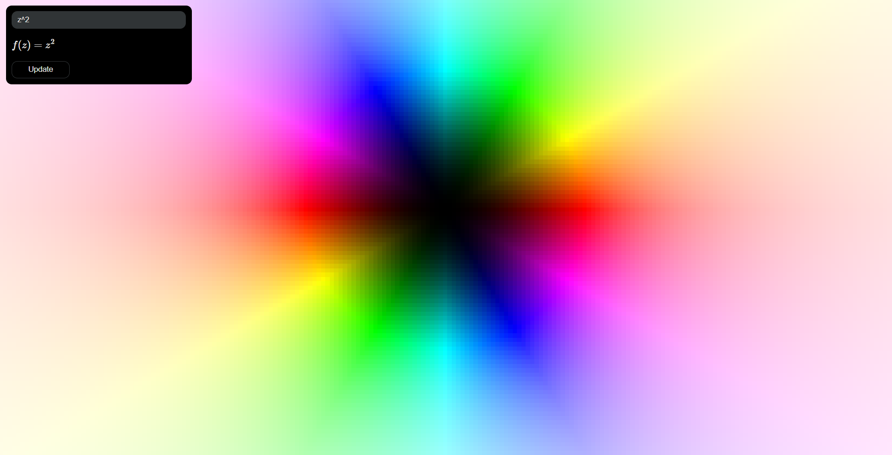
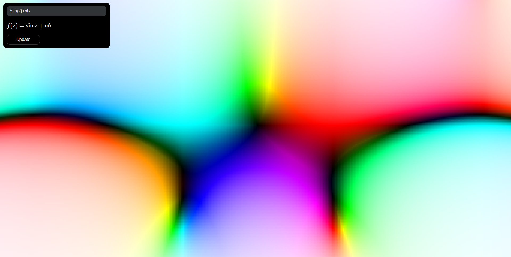

# Domain-Coloring

A program that shows complex function domain coloring

## Usage

Enter latex syntax in a formula box on the top left

### Conditions

- a : Real part of complex number z
- b : Imaginary part of complex number z
- \theta($\theta$) : arctan2(b, a) ($-\pi \sim \pi$)

### Examples

- $f(z)=z^z$
  
- $f(z)=(1+2i)^z$
  
- $f(z)=z^2$
  
- $f(z)=\sin z + ab$
  
